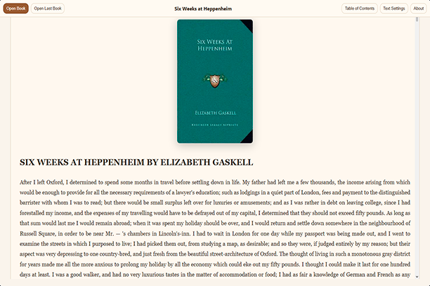
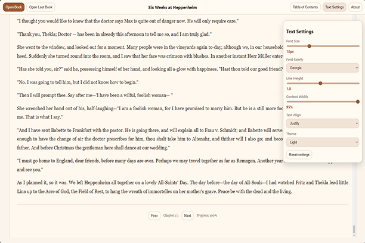

# Voxli Book Reader (Opera Extension)

Voxli Book Reader is a lightweight browser extension for reading local **EPUB** and **FB2** files directly in Opera.

## Promo & Screenshots






## Features

- Open local `.epub` and `.fb2` books from the popup.
- Continue reading the last opened book.
- Table of contents navigation and chapter switching.
- Reading progress tracking per book.
- Reader customization:
  - font size and family,
  - line height,
  - content width,
  - text alignment,
  - light / dark / sepia themes.
- Localized UI: English, Russian, German, French, Simplified Chinese, Traditional Chinese.

## Privacy

Voxli Book Reader works fully on-device:

- does **not** upload books to external servers,
- does **not** collect personal data,
- does **not** use analytics or tracking scripts.

All reading data is stored locally in browser extension storage.

## Permissions

The extension requests only:

- `storage` — save user settings and reading progress,
- `unlimitedStorage` — keep large local book cache/progress data.

## Project Structure

- `manifest.json` — extension manifest (MV3).
- `popup.html`, `reader.html`, `options.html` — extension pages.
- `src/` — core logic (reader, settings, storage, parsers).
- `_locales/` — localization messages.
- `icons/` — extension icons.

## Development

This project is plain JavaScript (no build step required).

1. Clone repository.
2. Open Opera Extensions page (`opera://extensions`).
3. Enable **Developer mode**.
4. Click **Load unpacked** and select the project folder.

## Packaging for Opera Add-ons

Create ZIP from the project root:

```bash
zip -r extension-release/voxli-book-reader-opera-v0.9.24-2026-03-04.zip \
  manifest.json options.html popup.html reader.html styles.css _locales icons src
```

Upload the generated ZIP to Opera Add-ons and provide this public source repository link:

- https://github.com/leszavr/voxli_book_reader

## Version

Current extension version: `0.9.24`
