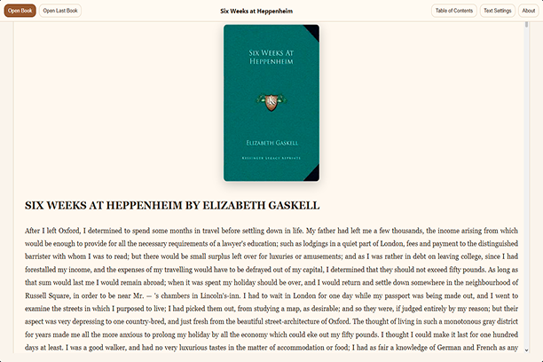
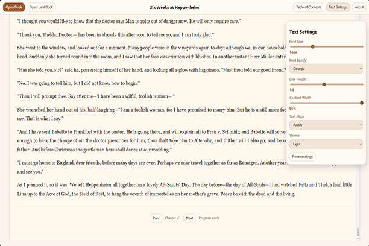

# Voxli Book Reader (Opera Extension)

Voxli Book Reader is a lightweight browser extension for reading local **EPUB** and **FB2** files directly in Opera.

## Promo & Screenshots

<p align="center">
  
</p>

<p align="center">
  
</p>

<p align="center">
  
</p>

## Features

- Open local `.epub` and `.fb2` books.
- Continue reading the last opened book.
- Table of contents navigation and chapter switching.
- Reading progress tracking per book.
- Reader customization:
  - font size and family,
  - line height,
  - content width,
  - text alignment,
  - light / dark / sepia themes.
- Localized UI: English, Russian, German, French, Simplified Chinese, Traditional Chinese.

## Privacy

Voxli Book Reader works fully on-device:

- does **not** upload books to external servers,
- does **not** collect personal data,
- does **not** use analytics or tracking scripts.

All reading data is stored locally in browser extension storage.

The public privacy policy for store submissions is available at:

- https://github.com/leszavr/voxli_book_reader/blob/main/PRIVACY.md

## Permissions

The extension requests only:

- `storage` — save user settings and reading progress,
- `unlimitedStorage` — keep large local book cache/progress data.

## Project Structure

- `manifest.json` — extension manifest (MV3).
- `reader.html` — reader page.
- `filepicker.html` — lightweight file picker window opened from the toolbar button when there is no recent book.
- `options.html` — extension options.
- `src/` — core logic (reader, settings, storage, parsers).
- `src/background.js` — handles toolbar button click.
- `_locales/` — localization messages.
- `icons/` — extension icons.

## Third-party libraries

This extension bundles the following third-party library as a vendored file:

- **JSZip v3.10.1** — used for reading `.epub` archives locally.
  - File: `src/vendor/jszip.min.js`
  - Source: https://stuk.github.io/jszip/
  - License: MIT or GPLv3 (see library header and upstream license text)

## Development

This project is plain JavaScript (no build step required).

1. Clone repository.
2. Open Opera Extensions page (`opera://extensions`).
3. Enable **Developer mode**.
4. Click **Load unpacked** and select the project folder.

## Packaging for Opera Add-ons and Chrome Web Store

Create a ZIP from the project root. The manifest must be at the archive root:

```bash
zip -r extension-release/voxli-book-reader-opera-v1.0.12.zip \
  manifest.json options.html filepicker.html reader.html styles.css _locales icons src
```

Upload the generated ZIP to Opera Add-ons and provide this public source repository link:

- https://github.com/leszavr/voxli_book_reader

For Chrome Web Store listing assets, use the files in `store-assets/`. Opera screenshots
are 612×408 pixels; Chrome requires screenshots at 1280×800 or 640×400 pixels and a
440×280 small promotional tile. The Chrome dashboard also requires privacy disclosures,
permission justifications, and the public privacy policy URL above.

## Version

Current extension version: `1.0.12`
